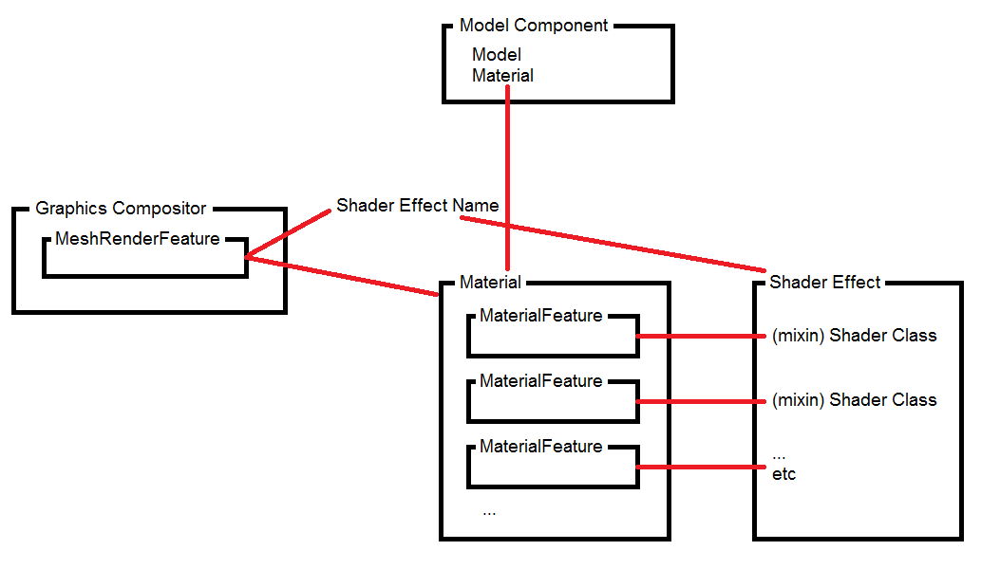
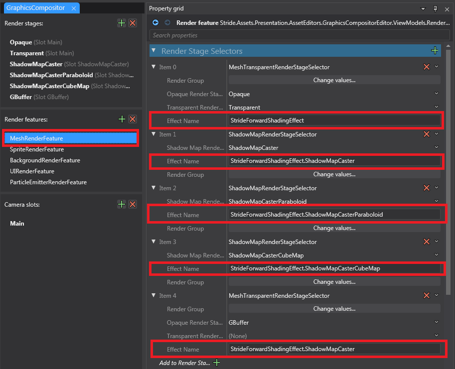
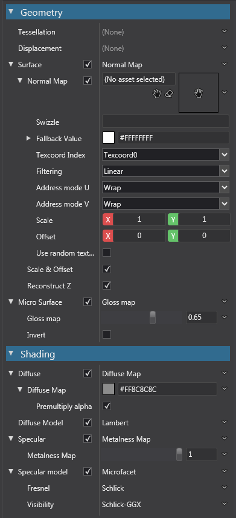
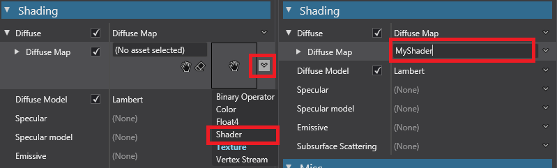
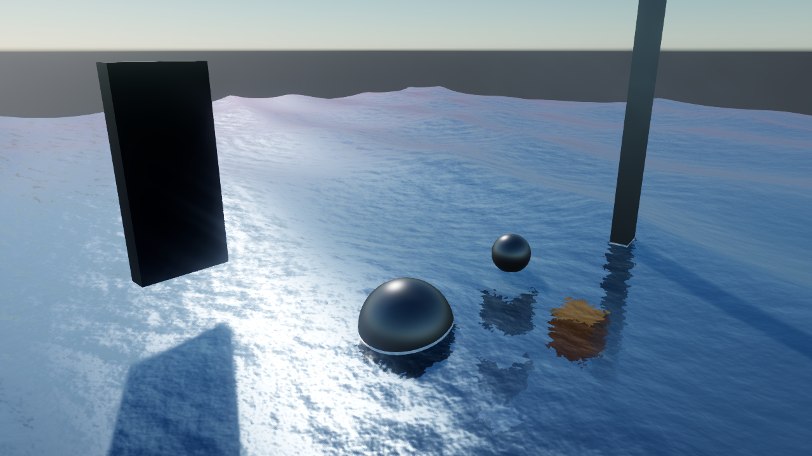
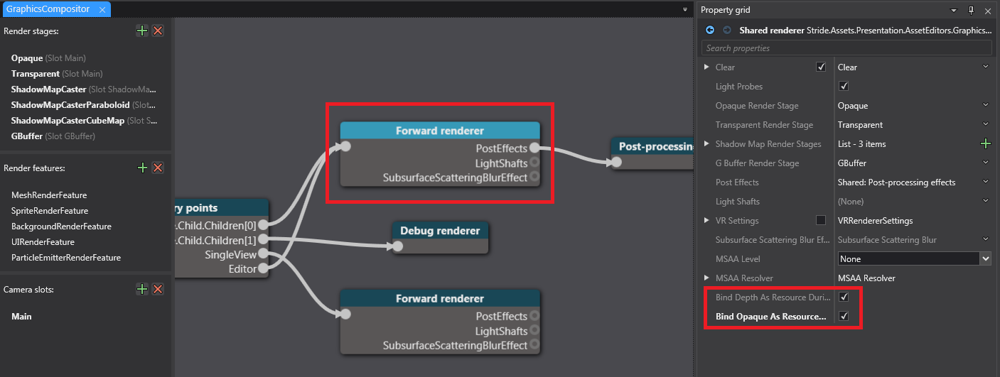
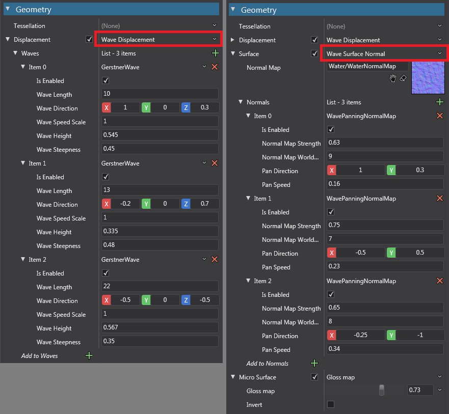
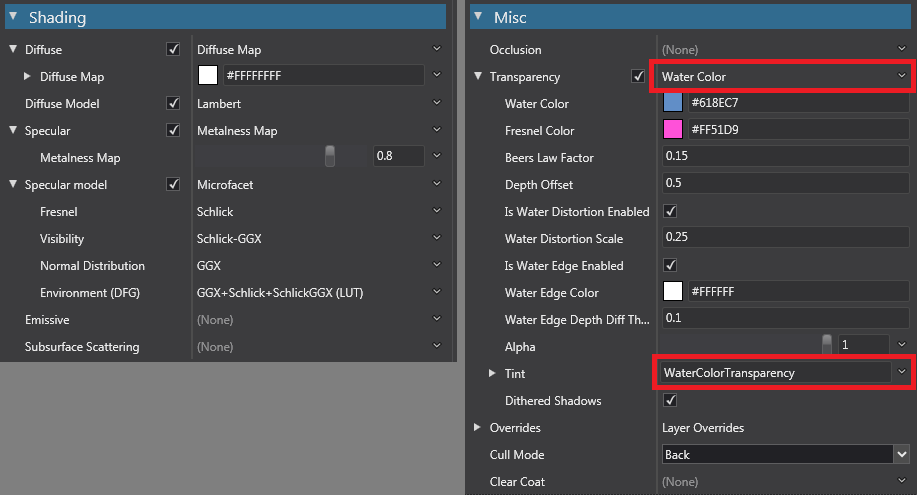

# An Unofficial Stride Material System's "Effects and Shaders" Companion Guide

> ## Disclaimer
> This document is written by a random average developer, so this should not be treated as official source of information. This guide is merely my interpretation on how to use Stride's shader system, and hopefully help you understand the system better.

---
## Purpose of this Guide

Please note that this is not a beginner's guide since there are a lot of initial shader knowledge required before you can approach this guide. This is also not an advanced guide, more specifically, this guide is not intended to dive deeply into the 'Shader Effect' side of things, since it is complicated.

The main intent of this guide is to hopefully help bridge the gap in knowledge from the official documentation [Effects and Shaders](https://doc.stride3d.net/latest/en/manual/graphics/effects-and-shaders/index.html) and how it works in the Stride engine and applying it in the Stride editor.

---

### Requirements before you read this document
* Read the official documentation [Effects and Shaders](https://doc.stride3d.net/latest/en/manual/graphics/effects-and-shaders/index.html)
* Basic shader knowledge, such as shader pipeline
* The ability to write code (knowing any programming language, eg. C#, means you can quickly pick up writing shader code)

---
---

## Engine-Shader Relationship

An overview of how the engine uses the 'shader' can be seen in the diagram below:



- An Entity (game object) in a scene requires a `ModelComponent` (this is just called a 'Model' in the editor). The Entity's `ModelComponent` references a `Material` asset, which is effectively the 'shader' that is applied to the model.
- The `Material` asset is an editor-focused general purpose **shader builder**, which exposes common shader properties, via `MaterialFeature`s, that you can set (eg. Displacement, Normal Map, Diffuse, etc). Depending on the context of the `MaterialFeature` you can set simple data (eg. `Color`, `float`, `Texture`), or set your own 'Shader Class' for passing data with more complex logic.
- The `Graphics Compositor` asset declares all the rendering capabilities the Stride engine uses to render things on the screen, through `RenderFeature`s. The main `RenderFeature` of interest is the `MeshRenderFeature`. The `MeshRenderFeature` is where you declare the 'Shader Effect' you want to use (via the shader's name), and when it comes to fully build the 'shader' the `Material` asset calls each `MaterialFeature` to provide its relevant 'Shader Class' that will be merged into the 'Shader Effect'.

---
---
## Shader code language

In order to write any **shader code** for Stride, you need to know some basic knowledge on writing with HLSL (eg. declaring variables such as `float3`/`float4x4`, calling functions like `mul`/`lerp`, etc), which can then be transferred to writing Stride shader code, since Stride's shader language (**SDSL**) is a superset of HLSL.

As long as you've already got some basic programming language skills (eg. C#), you should be able to quickly skim through [official documentation on HLSL](https://learn.microsoft.com/en-us/windows/win32/direct3dhlsl/dx-graphics-hlsl-writing-shaders-9) and see the coding style/syntax is mostly the same.

---
## Stride 'Effect' & 'Shader' Relationship

For those coming from other game engines where you generally write the whole "shader" in a single file, this does not appear as straight forward in Stride.
There are effectively two types of 'shaders' in Stride. 'Effects' (`.sdfx` files) & 'Shaders' (`.sdsl` files).

To help make the distinction clearer, this guide will call the Stride 'Effect' as **Shader Effect** (`.sdfx` type) , and 'Shader' (`.sdsl` type) as **Shader Class**.
Any mention of 'shader code' has with no greater meaning, it is just actual code that you write.
> While the official documentation does not call the `.sdsl` shaders as 'Classes', internally the engine refers them as [ShaderClassSource](https://github.com/stride3d/stride/blob/master/sources/engine/Stride.Shaders/ShaderClassSource.cs) objects.

From a high level view, a Shader Effect is the closer term that people from other game engines are thinking of when they talk about 'shaders'. In Stride, the Shader Effect forms the final code that then gets compiled to HLSL/GLSL/SPIR-V for the graphics card to execute.

In Stride, the purpose of **Shader Classes** are to break down shader code in a Shader Effect into *smaller* (and usually reusable) pieces of code.
This is why the word 'shader' starts to blur between 'Effect' & 'Shader', because the Effect can essentially be just a bunch of 'Shader' code combined to form the full 'shader'.

Shader Classes can be thought of as being similar to C# classes, each class on its own is separate from another class, you can inherit other classes and override the base class's methods/functions. You can "reference" other classes and execute their methods (eg. `compose ComputeColor ...`).
It is important to note that Shader Classes have no impact on their own. In order to function, they must be plugged in *somewhere* in order to be executed, either directly to a Shader Effect, or plugged into another Shader Class which is connected the Shader Effect (or continue chaining up until it the final parent is the Shader Effect).

When authoring your own Shader Effect, you technically can ignore writing any Shader Classes and just directly write all your shader code/functions in the Shader Effect, however if you look at Stride's source code, you'll notice they heavily lean into plugging in Shader Classes into their Shader Effects since they reuse/share their shader code in multiple Shader Effects.


> If you wish to see all the Shader Classes used, you can view all the `.sdsl` files from in the [Github source repository](https://github.com/stride3d/stride), or you can download the very helpful [Shader Explorer application.](https://github.com/tebjan/Stride.ShaderExplorer/releases)
>
> If you want to see any Shader Effects (`.sdfx` files), you'll need to view from the Github source repository linked above, eg. [StrideForwardShadingEffect.sdfx](https://github.com/stride3d/stride/blob/master/sources/engine/Stride.Rendering/Rendering/StrideForwardShadingEffect.sdfx)

---
---
## Overview of the Shader Effect

The bare minimum to do any advance rendering with a model/mesh (ie. apply a 'shader' to it) requires a **Shader Effect**.
The entry points to run the 'vertex shader' and 'pixel shader' (also known as the fragment shader) in a Shader Effect are declared as `VSMain()` and `PSMain()`. Note the [documentation specifies the other possible entry points](https://doc.stride3d.net/latest/en/manual/graphics/effects-and-shaders/shading-language/shader-stages.html), but for the sake of this guide, only the vertex & pixel shader will be discussed since they are the most commonly used stages.

As per the [Effect Language documentation](https://doc.stride3d.net/latest/en/manual/graphics/effects-and-shaders/effect-language.html#general-syntax), an example effect is given:

```hlsl
using Stride.Effects.Data;

namespace StrideEffects
{
    params MyParameters
    {
        bool EnableSpecular = true;
    };
    
    effect BasicEffect
    {
        using params MaterialParameters;
        using params MyParameters;

        mixin ShaderBase;
        mixin TransformationWAndVP;
        mixin NormalVSStream;
        mixin PositionVSStream;
        mixin BRDFDiffuseBase;
        mixin BRDFSpecularBase;
        mixin LightMultiDirectionalShadingPerPixel<2>;
        mixin TransparentShading;
        mixin DiscardTransparent;

        if (MaterialParameters.AlbedoDiffuse != null)
        {
            mixin compose DiffuseColor = ComputeBRDFDiffuseLambert;
            mixin compose albedoDiffuse = MaterialParameters.AlbedoDiffuse;
        }

        if (MaterialParameters.AlbedoSpecular != null)
        {
            mixin compose SpecularColor = ComputeBRDFColorSpecularBlinnPhong;
            mixin compose albedoSpecular = MaterialParameters.AlbedoSpecular;
        }
    };
}
```

Ignoring the `params`/`using params` declarations (beyond the scope of this guide), the `mixin [ShaderName]` declaration are the lines of interest.
There exists Shader Classes named `ShaderBase`, `TransformationWAndVP`, etc, and the shader code from these Shader Classes will be copied/merged into this Shader Effect.

You may notice that there in the above shader there doesn't appear to be a `VSMain()` or `PSMain()` explicitly declared in this Effect. While most of the Shader Classes in this example doesn't exist in Stride, `ShaderBase` is actually a real Shader Class from Stride and that Shader Class does contain a `VSMain()` and `PSMain()`. Do note that technically the `VSMain()` & `PSMain()` in `ShaderBase` are empty so by itself would crash when executing this shader because neither assigns the output vertex position & output pixel color - it is expected one of the later fictional Shader Classes have overridden `VSMain()` & `PSMain()` to fulfilled this requirement, see [the documentation on what variables must be assigned for each shader stage.](https://doc.stride3d.net/latest/en/manual/graphics/effects-and-shaders/shading-language/shader-stages.html)


---
---
## How the Shader Effect is used

Applying a Shader Effect is a little complicated. In Stride, if you open the `Graphics Compositor` asset in a project, you can see how the Stride engine is using their Shader Effects by default:



In the above image, the `MeshRenderFeature` has four render stages (as seen in the Render Stage Selectors on the right section). When it is `MeshRenderFeature`'s turn to render, each stage will determine whether to include the model/mesh based on matching the `Render Group` on the stage selector with the `Render Group` on the `ModelComponent` of the entity, then build the final shader by combining the Material properties into the `Shader Effect`, as specified by the `Effect Name` property. It is also the job of the render feature to pass any dynamic parameters declared on the shader (ie. passing application data to the shader, eg. game time, camera information, etc).

> Note that `MeshRenderFeature` is special in that it is actually further divided by having `SubRenderFeature`s, which are used to pass any dynamic parameters instead of the `MeshRenderFeature`, due to being the most complex render feature.
>
> eg. `TransformRenderFeature` is a `SubRenderFeature` for  `MeshRenderFeature`, and you can see it passing data such as [game time and camera settings](https://github.com/stride3d/stride/blob/dad92aaa2bd294ae302261fdde52583ab329a6f5/sources/engine/Stride.Rendering/Rendering/TransformRenderFeature.cs#L76) to the shader in the `Prepare` method.

---
<details>
<summary>Click here for a quick examination of 'StrideForwardShadingEffect.sdfx' if you're curious.</summary>

You can see [the source code for StrideForwardShadingEffect.sdfx](https://github.com/stride3d/stride/blob/master/sources/engine/Stride.Rendering/Rendering/StrideForwardShadingEffect.sdfx) (relevant code copied below):

```hlsl
effect StrideForwardShadingEffect
{
    using params MaterialKeys;

    // Derive from StrideEffectBase
    mixin StrideEffectBase;

    // -----------------------------------------------
    // Mix material and lighting shading for Pixel Shader
    // -----------------------------------------------
    ShaderSource extensionPixelStageSurfaceShaders = MaterialKeys.PixelStageSurfaceShaders;
    if (extensionPixelStageSurfaceShaders != null)
    {
        mixin MaterialSurfacePixelStageCompositor;
        mixin compose materialPixelStage = (extensionPixelStageSurfaceShaders);
        mixin compose streamInitializerPixelStage = MaterialKeys.PixelStageStreamInitializer;

        ShaderSource extensionPixelStageSurfaceFilter = MaterialKeys.PixelStageSurfaceFilter;
        if (extensionPixelStageSurfaceFilter != null)
        {
            mixin (extensionPixelStageSurfaceFilter);
        }

        mixin child GBuffer;
    }

    // -----------------------------------------------
    // Add direct and environment light groups
    // -----------------------------------------------
    mixin StrideLighting;

    mixin child ShadowMapCaster;
    mixin child ShadowMapCasterParaboloid;
    mixin child ShadowMapCasterCubeMap;
};
```
For the most part, it doesn't seem much different compared to the earlier `BasicEffect` example, every mixin is just a reference to a Shader Class which you can examine. I will leave it to the reader to discover where the `VSMain()` and `PSMain()` functions are declared.
</details>

---

> Unfortunately, this guide will not go further into explaining how to plug in your own Shader Effect, as that falls into the 'advanced' category, however you can look at Stride's Space Escape sample project as an example (and look at the Graphics Compositor setup).

---
---
## Writing *your* Shader(s)

While it is possible to write a complete 'shader' with your own Shader Effect, this requires a bit of set up (eg. changing Shader Effect Name in the Graphics Compositor, passing additional data through the RenderFeature, etc).

The recommended way is **not** write a Shader Effect, but instead utilize Stride's Material system and write **Shader Classes** and add them to the relevant `MaterialFeature`. This is because the Material system has basically already set up most of the "busy-work"/data of the shader and just exposes the most commonly used properties (eg. Displacement, Normal Map, Diffuse, etc) where you can slot in your data/modifications, then it will build the final shader code for you.

Stride's `Material` can be seen as a shader template that exposes common shader properties to the editor, where you can set these property 'values' (eg. texture, color, etc):



 If a more advanced property value is required, you can choose to set a Shader Class by changing the value type with the dropdown button on the right side next to the value to 'Shader' then start typing in your Shader's name:


> The Shader textbox does not immediately display any available list of Shaders until you start typing at least one character in the textbox.

In order for the 'main' shader to know how to call your shader, your shader must inherit from the `ComputeColor` Shader Class.
This is similar to how in C#, you inherit from an `interface`/`class` and implement (or override) a specific method so a third party library knows how to call your object.

As seen in the [ComputeColor.sdsl](https://github.com/stride3d/stride/blob/master/sources/engine/Stride.Rendering/Rendering/Materials/ComputeColors/Shaders/ComputeColor.sdsl), it has a `Compute()` method that returns a `float4`, and this gets called by some shader code that sits 'above' your Shader Class.


The reason why you can select different value types in the Material property is because the underlying shader exposes these properties via the `compose` keyword.

eg. The 'Diffuse Map' property in the `Shading` -> `Diffuse` property can be seen in the [shader itself:](https://github.com/stride3d/stride/blob/master/sources/engine/Stride.Rendering/Rendering/Materials/Shaders/MaterialSurfaceDiffuse.sdsl)
```hlsl
shader MaterialSurfaceDiffuse : IMaterialSurfacePixel
{
    compose ComputeColor diffuseMap;

    override void Compute()
    {
        var colorBase = diffuseMap.Compute();
        streams.matDiffuse = colorBase;

        // Because matDiffuse can be modified when using a metalness, we are storing the colorBase into matColorBase
        // so that we are able to query the original diffuse color without any modifications.
        streams.matColorBase = colorBase;
    }
};
```

Here you can see that `diffuseMap` will be the exposed property, and its expected type is `ComputeColor`. Therefore, when you write your own shader that is expected to slot into the Diffuse Map property, you must make sure it inherits from `ComputeColor` to satisfy the class constraint.

> An interesting side note: The other property value type options (Binary Operator, Color, Float4, Texture, Vertex Stream) are also `ComputeColor` shaders, but these are essentially hardcoded ones explicitly set to appear separately in the editor!

All properties exposed in the Material property that can be changed to a Shader type are expected to be Shader Classes that inherit from `ComputeColor`.

**Important Note:** Be aware that different `MaterialFeature`s interpret the returned `float4` value differently, which unfortunately is not currently documented, and may require digging through the source code.

Examples:
- Displacement only uses `*.x`, ie. the first component of the `float4`, and is just [the displacement along the mesh's normal vector,](https://github.com/stride3d/stride/blob/master/sources/engine/Stride.Rendering/Rendering/Materials/Shaders/MaterialSurfaceVertexDisplacement.sdsl) ie. it is actually only a **height** displacement function.
- Diffuse Map using the alpha value is dependent on other shader functions used. Most notably if `Misc` -> `Transparency` is not enabled, the alpha value will not make the model transparent (although 'Premultiply alpha' will still affect the final color, it will still be opaque).

---
---

# Water shader example

> ## Disclaimers
> - This is not a step-by-step guide on how to write your shader.
> - The main aim of the demo project is to showcase various techniques that can be used when writing your own shader.
> - This is not a feature complete water shader.

---
### References
The shader was adapted and modified from the following sources:

- The displacement function: https://developer.nvidia.com/gpugems/gpugems/part-i-natural-effects/chapter-1-effective-water-simulation-physical-models
- Panning normal map(s): [Water Shaders series](https://www.youtube.com/playlist?list=PL78XDi0TS4lHBWhZJNOrslnkFWHwE67ak) from [Ben Cloward](https://www.youtube.com/@BenCloward)
- Water color/edge detection: [How To Create A Water Shader // Godot 4 Tutorial](https://www.youtube.com/watch?v=7L6ZUYj1hs8) fron [StayAtHomeDev](https://www.youtube.com/@stayathomedev)

*Note*: This project is not a one-to-one adaptation of the referenced materials.

---

The project provided in this guide shows a water shader that appears as the following:



The water shader has the following features:
- Allow multiple Vertex displacement functions (Gerstner waves)
- Allow multiple UV panning sampling of a Normal Map texture
- Setting the color of the water
- Setting the color of the Fresnel Effect on the water
- Distortion of objects under the water surface
- Setting the color of water edge (the contact point of the water and object)

**Important Note:** Ensure the Graphics Compositor have the following two settings enabled on the Forward renderer (as shown in the screenshot below):
- Bind Depth As Resource During Transparent Rendering
- Bind Opaque As Resource During Transparent Rendering



This is to allow the shader to 'see' the objects under the water surface so we can correctly anything under the water surface.

The Material properties of the Water Material are seen in the images below:





Despite the ability to use generics and/or `compose ComputeColor` on a shader, the editor still has some limitations, eg.
- Generics can only expose 'Color' types as `float3`/`float4`, so the editor can't show a color picker control.
- `compose ComputeColor` can be a little clunky when used for something like sampling a texture.
- Having an array of sub-shader functions does not appear in the editor.

To overcome the limitations, it is easier to create our own `MaterialFeature` derivative to expose any desired properties and build the Shader Class with the defined properties.

The way to define your properties are exactly the same way as you would when exposing properties on your standard Stride `SyncScript`/`AsyncScript`s. When implementing your own `MaterialFeature`, you must override `GenerateShader(MaterialGeneratorContext context)` method to pass in your Shader Class through a `ShaderMixinSource` object, and set any external custom data that the shader needs (you do not need to manually pass in data that Stride already passes in, eg. `Global.Time`).

> The easiest way to determine how each `MaterialFeature` should be implemented is to examine the source code of the existing `MaterialFeature`s, eg.
> - Displacement: [MaterialDisplacementMapFeature.cs](https://github.com/stride3d/stride/blob/master/sources/engine/Stride.Rendering/Rendering/Materials/MaterialDisplacementMapFeature.cs)
> - Surface/Normal Map: [MaterialNormalMapFeature.cs](https://github.com/stride3d/stride/blob/master/sources/engine/Stride.Rendering/Rendering/Materials/MaterialNormalMapFeature.cs)
> - Diffuse: [MaterialDiffuseMapFeature.cs](https://github.com/stride3d/stride/blob/master/sources/engine/Stride.Rendering/Rendering/Materials/MaterialDiffuseMapFeature.cs)
> - Transparency: [MaterialTransparencyBlendFeature.cs](https://github.com/stride3d/stride/blob/master/sources/engine/Stride.Rendering/Rendering/Materials/MaterialTransparencyBlendFeature.cs)
>
> **IMPORTANT:** Make sure to save all your changes in the editor before modifying your custom `MaterialFeature`, as the editor may crash if the editor can't handle your changes.

It should be important to note that the shaders returned in `MaterialFeature.GenerateShader()` are shaders that implement `IMaterialSurface` or `IMaterialSurfacePixel` (depending on the feature) and they are expected to override `void Compute()` method. Because these methods *do not* have any return values, the way to 'share' data is to set specific `streams` variables, which the overall shader uses (again, it would be wise to examine the source code to determine which variables gets used).

The project has three new `MaterialFeature`s to make it easier to define the water properties:

- [MaterialWaveDisplacementFeature.cs](StrideShaderDemo/StrideShaderDemo/Rendering/MaterialWaveDisplacementFeature.cs)
  - Contains a hardcoded shader name reference `"MaterialWaveDisplacement"` which is defined in [MaterialWaveDisplacement.sdsl](StrideShaderDemo/StrideShaderDemo/Effects/Displacement/MaterialWaveDisplacement.sdsl)
  - Exposes a list of displacement wave properties, which you can add as many displacement waves as possible, which is slotted in via `compose ComputeWaveDisplacement DisplacementFunctions[];` in the `MaterialWaveDisplacement` shader. The `GenerateShader` method shows how to feed in the sub-shaders into `MaterialWaveDisplacement`'s `compose` array property.
  - The wave property defined in [WaveDisplacement.cs](StrideShaderDemo/StrideShaderDemo/Rendering/DisplacementParameters/WaveDisplacement.cs) and the `GerstnerWave` object will supply the hardcoded shader name reference `"ComputeGerstnerWave"` which is defined in [ComputeGerstnerWave.sdsl](StrideShaderDemo/StrideShaderDemo/Effects/Displacement/ComputeGerstnerWave.sdsl)
  - `WaveDisplacementBase` base class (which `GerstnerWave` derives from) exists so you can implement and choose a different wave displacement function.

- [MaterialWaveSurfaceNormalFeature.cs](StrideShaderDemo/StrideShaderDemo/Rendering/MaterialWaveSurfaceNormalFeature.cs)
  - Contains a hardcoded shader name reference `"MaterialWaveSurfaceNormal"` which is defined in [MaterialWaveSurfaceNormal.sdsl](StrideShaderDemo/StrideShaderDemo/Effects/Displacement/MaterialWaveSurfaceNormal.sdsl)
  - Exposes a single `NormalMap` texture property to be passed in the shader and sampled by the `WavePanningNormalMap` properties.
  - The wave panning texture sampler(s) properties are defined in [WavePanningNormalMap.cs](StrideShaderDemo/StrideShaderDemo/Rendering/TextureParameters/WavePanningNormalMap.cs) and the `WavePanningNormalMap` object will supply the hardcoded shader name reference `"ComputeWaveNormalPanningUv"` which is defined in [ComputeWaveNormalPanningUv.sdsl](StrideShaderDemo/StrideShaderDemo/Effects/Texture/ComputeWaveNormalPanningUv.sdsl)

- [MaterialWaterColorFeature.cs](StrideShaderDemo/StrideShaderDemo/Rendering/MaterialWaterColorFeature.cs)
  - Derives from `MaterialTransparencyBlendFeature` so we do not need to set up the main shader details, but just passes in any water properties via the material keys (the material keys are auto-generated when you define the properties in the Shader Classes).
  - The color is set here, rather than the Diffuse Map because we need access to the depth and opaque textures, which allows the shader to 'see' what is underneath the water surface and override what is rendered on the water's surface (eg. less transparent water at greater depth, distorting the object under the water). `MaterialTransparencyBlendFeature.GenerateShader()` sets the necessary flags required for the shader to be executed after the opaque objects have been rendered first. Note that the Diffuse Map will still need to set a white color, due to quirks on how the overall shader works.
  - As stated earlier, make sure the `Graphics Compositor` has 'Bind Depth' and 'Bind Opaque' settings enabled.

Information about each shader implementation:

- [MaterialWaveDisplacement.sdsl](StrideShaderDemo/StrideShaderDemo/Effects/Displacement/MaterialWaveDisplacement.sdsl)
  - This shader displaces the vertex position in all directions (ie. x, y, z). Because of this, we need to update the normal vector to ensure the lighting is correct, and also the tangent vector because the default shader requires this. The bitangent is not needed to be set. Therefore, we set the following `streams` variables:
    - `streams.Position`
    - `streams.meshNormal`
    - `streams.meshTangent`

- [ComputeWaveDisplacement.sdsl](StrideShaderDemo/StrideShaderDemo/Effects/Displacement/ComputeWaveDisplacement.sdsl)
  - This is shared by both `ComputeGerstnerWave` and `MaterialWaveDisplacement` shaders. The purpose of this 'class' is so `MaterialWaveDisplacement` knows what method should be called and what the output values are.
  > Ideally a custom struct as a return value would be used, however as of Stride version `4.2.0.2188` this fails to compile, so just passing data around via `streams` is used instead.

- [ComputeGerstnerWave.sdsl](StrideShaderDemo/StrideShaderDemo/Effects/Displacement/ComputeGerstnerWave.sdsl)
  - The actual wave position displacment implementation, based of the GPU Gems article.
  - This shader uses generics for setting the parameters. [GerstnerWave](StrideShaderDemo/StrideShaderDemo/Rendering/DisplacementParameters/WaveDisplacement.cs) shows how values are passed from the editor to the shader. Note that when passing generics values, the values must be strings as valid shader data types (eg. `Vector2` values should be passed as `float2(x, y)`)

- [MaterialWaveSurfaceNormal.sdsl](StrideShaderDemo/StrideShaderDemo/Effects/Displacement/MaterialWaveSurfaceNormal.sdsl)
  - This shader just sums all the normal vectors calculated from each `ComputeWaveNormal` shader.
  - The default engine's [MaterialSurfaceNormalMap](https://github.com/stride3d/stride/blob/master/sources/engine/Stride.Rendering/Rendering/Materials/Shaders/MaterialSurfaceNormalMap.sdsl) shader states `streams.matNormal` does not need to be normalized at this step, so this has also been ignored in our shader.

- [ComputeWaveNormal.sdsl](StrideShaderDemo/StrideShaderDemo/Effects/Texture/ComputeWaveNormalPanningUv.sdsl)
  - This is shared by both `ComputeWaveNormalPanningUv` and `MaterialWaveSurfaceNormal` shaders. The purpose of this 'class' is so `MaterialWaveSurfaceNormal` knows what method should be called and what the output values are.

- [ComputeWaveNormalPanningUv.sdsl](StrideShaderDemo/StrideShaderDemo/Effects/Texture/ComputeWaveNormalPanningUv.sdsl)
  - Samples the normal map texture based on the specified world size, direction, and speed.

- [WaterColorTransparency.sdsl](StrideShaderDemo/StrideShaderDemo/Effects/Water/WaterColorTransparency.sdsl)
  - While the shader could expose the water parameters as generics, having the parameters as properties also exposes the material keys (see [WaterColorTransparencyKeys](StrideShaderDemo/StrideShaderDemo/Effects/Water/WaterColorTransparency.sdsl.cs)). While not done in this project, you can potentially add a `SyncScript` and manipulate the water's color at run-time, eg. for day-night cycle.
  - The color output of the water mesh is determined by the depth distance from the water's surface to the underlying object.
  - The water does not have realistic refraction. It is merely distortion done by sampling the opaque texture (ie. everything rendered before the transparent objects) offsetting the UV based off the calculated surface normal.
  - The water edge detection is just a simple depth difference threshold.
